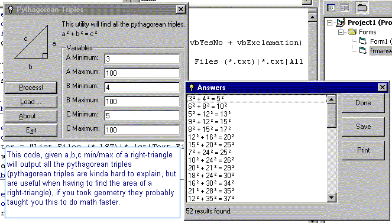



## Pythagorean Triples Finder

### Description

Finds all Pythagorean Triples given in a specific range.
 
### More Info
 
a, b, c minimum/maximum of a right-triangle

Takes a while to process, it made about 15 processes/second on a AMD 900 mhz with 384 mb RAM, so don't make high maximums

Pythagorean Triples in the given range

             |
---                |---
**Submitted On**   |2001-09-16 08:30:18
**By**             |[Yusuf Simonson](https://github.com/Planet-Source-Code/PSCIndex/blob/master/ByAuthor/yusuf-simonson.md)
**Level**          |Advanced
**User Rating**    |5.0 (10 globes from 2 users)
**Compatibility**  |VB 4\.0 \(32\-bit\), VB 5\.0, VB 6\.0
**Category**       |[Math/ Dates](https://github.com/Planet-Source-Code/PSCIndex/blob/master/ByCategory/math-dates__1-37.md)
**World**          |[Visual Basic](https://github.com/Planet-Source-Code/PSCIndex/blob/master/ByWorld/visual-basic.md)
**Archive File**   |[Pythagorea265309162001\.zip](https://github.com/Planet-Source-Code/yusuf-simonson-pythagorean-triples-finder__1-27291/archive/master.zip)

